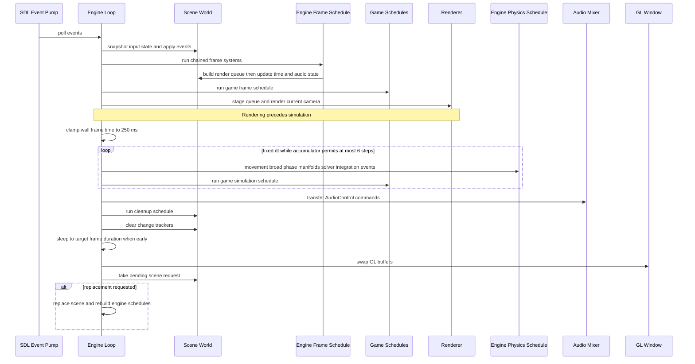

The root Cargo workspace has two members: the reusable `engine` library and the `Game` binary. The `Game` manifest names `src/main.rs` as its binary target and depends on `engine` by the local `../engine` path. Its entry point constructs `Engine`, populates the exposed scene world with entities and components, registers gameplay systems on the scene schedules, loads assets, and then calls `engine.run()`.

This is a deliberately thin application boundary: gameplay is not a callback trait implemented by the binary. Instead, it is Bevy ECS data and systems placed into the `Scene` held by the engine. `Game` directly declares `bevy_ecs` and uses its scheduling extension trait to install systems; it also declares bundled `sdl2` to name `Keycode` values in those systems. Those dependencies do not transfer platform ownership: the engine retains the SDL event pump, OpenGL context and window, renderer, audio stream/mixer, engine schedules, and main loop. The game owns game-specific components, entity setup, asset selection, and systems, and consumes engine-provided input state rather than polling events itself.

## Ownership and public integration surface

`Engine::new()` initializes logging, then creates the SDL video subsystem, a resizable `1024 × 769` OpenGL window, and a current forward-compatible OpenGL 3.3 core context. It creates the `glow` context, `Renderer`, and default `AudioMixer`; the latter opens and starts the default CPAL output stream. These platform and device objects are private engine fields, so game code does **not** issue SDL polling, swap the GL window, or call renderer/mixer methods directly.

The intentionally exposed integration point is `Engine::scene`. It contains a public `World`, `game_frame_schedule`, and `game_simulation_schedule`. Game setup can therefore spawn components, set resources such as `ActiveCamera`, and use normal Bevy `Schedule::add_systems` APIs. The sample binary demonstrates both schedule types: controller and gameplay systems are chained into the simulation schedule, while camera switching, sound control, and scene switching are registered in the frame schedule.

The engine crate exposes domain modules for assets, audio control, components, input, physics, rendering, scenes, and world basis. It also re-exports common gameplay-facing types at its root, including `Engine`, transform/velocity/camera/render-body components, collision shapes and layers, handles, `Gravity`, `TimeResource`, `WorldBasis`, `MouseButton`, and `CollisionSystem`. Useful `Engine` convenience methods are:

- `load_model` for `.gltf`, `.glb`, `.obj`, and the currently routed `.fbx` loader; it returns `None` for an unsupported extension.
- `load_wav`, which resamples a WAV for the output device sample rate and stores it under a `SoundHandle`.
- `aabb_from_render_body` and `mesh_collider_from_render_body` for deriving collision setup from a loaded render body.
- `new_scene`, which constructs a fresh scene using the engine's retained shared services.
- `run`, the terminal main-loop call for the configured engine instance.

Keep engine-internal scheduling and platform ownership private. New game behavior normally belongs in a system registered on one of the two game schedules, not in a second event loop or a direct rendering/audio backend call. See [ECS scenes and resources](/openwiki/concepts/ecs-scenes-and-resources.md) for the data model, [assets and rendering](/openwiki/integrations/assets-and-rendering.md) for handles and asset loading, and [audio and spatial sound](/openwiki/integrations/audio-and-spatial-sound.md) for sound components and commands.

## What a new scene contains

`Scene::new` builds a fresh Bevy `World` and inserts both the cloned `SceneServices` bundle and each shared asset resource: meshes, textures, shaders, sounds, render bodies, and materials. It also installs per-scene runtime resources: `RenderQueue`, `ActiveCamera`, `InputStateResource`, `WorldBasis`, physics and collision frame data, `Gravity`, `AudioControl`, and `SceneChangerResource`.

The engine-level `SceneServices` is retained for the engine lifetime and is cloned into every new scene. Consequently, a scene replacement resets entities and per-scene state but retains the shared asset stores, renderer, and audio mixer. `Scene::new` configures a 60 FPS target frame duration and a 120 Hz fixed simulation interval; do not assume `TimeResource::default()`'s 60 Hz simulation default applies to normal scenes.

A scene must retain the resources that engine schedules expect. The main loop uses `expect` for `TimeResource`, `InputStateResource`, `RenderQueue`, asset resources, `AudioControl`, and `SceneChangerResource`; manually replacing the world or removing one causes a panic rather than a degraded mode. Rendering is more tolerant of camera configuration: the renderer clears the frame, but returns after restoring the viewport if `ActiveCamera` is absent or its entity does not have the required transform and camera components.

## Ordered runtime lifecycle

The ordering below is part of the engine contract. In particular, rendering happens **before** fixed simulation, which favors visual/input responsiveness but means it uses the render queue built earlier in the frame, before the current frame's fixed steps. A game system that mutates a transform in a fixed step will normally become visible through the next frame's queue build.

*One engine frame from SDL input through presentation, bounded fixed simulation, cleanup, and deferred scene replacement.*

### 1. Input snapshot and frame-only schedules

At the start of a frame, the engine copies current keys and mouse buttons to their previous sets, resets mouse and scroll deltas, then drains the SDL event pump. Quit ends the loop. Key/button down and up update the current sets; mouse motion and wheel events set their respective per-frame deltas, with flipped wheel direction inverted. `InputStateResource` derives `key_held`, `key_pressed`, `key_released`, and the corresponding mouse predicates from current versus previous state. Query it from either game schedule; edge predicates remain true for all fixed steps executed in that render frame.

The engine frame schedule is chained in this exact order:

1. rebuild `RenderQueue` from entities with `TransformComponent` and `RenderBodyComponent`;
2. update `TimeResource` from elapsed wall time;
3. enqueue new `AudioSourceComponent` emitters;
4. enqueue changed spatial-listener and source positions, removed sources, and hit sounds based on the collision data already present.

Only after that chain does `game_frame_schedule` run. It is the place for behavior intended once per visual frame, such as input-triggered toggles and scene requests. Because render instances are copied into the queue before this game schedule, changing a renderable transform here also does not update this frame's already-built queue.

### 2. Render before simulation

The engine computes the window-size render parameters and derives camera data from the `ActiveCamera` entity. It stages the queued instances, reads mesh/material/texture/shader resources, and renders, then later swaps the GL window. The renderer owns GPU state and enables depth testing, clears color/depth, configures the viewport, culls/batches instances, and draws. This ordering is intentional and should not be reversed casually: it changes visible latency and when gameplay changes appear.

### 3. Bounded fixed simulation

The loop measures elapsed wall time since the prior frame, clamps that contribution to 250 ms to avoid pathological debugger/window-drag catch-up, and adds it to an accumulator. It runs fixed steps while enough time is accumulated, but never more than six per frame. Each step executes the chained engine physics order—movement, collision AABB cache, broad-phase tree, manifold generation, solver, integration, and physics-event dispatch—then executes `game_simulation_schedule`. Each engine physics system reads `TimeResource::simulation_fixed_dt()`, rather than frame delta time.

If the six-step cap is reached, the remaining accumulator is reduced to no more than one fixed interval. This intentionally sheds backlog rather than allowing unbounded catch-up. A simulation system may therefore run zero to six times per rendered frame, and must be deterministic under repetition at the configured fixed step. For physics behavior and collision invariants, see [physics and collision](/openwiki/concepts/physics-and-collision.md).

### 4. Audio handoff, cleanup, pacing, and change detection

Both engine and game systems enqueue high-level actions in the per-scene `AudioControl` resource. After all fixed steps, the engine translates those actions with `SoundResource` into mixer commands and pushes them through a 4096-entry ring buffer consumed by the CPAL callback. The audio callback owns tracks, voices, listener/source positions, and mixing; the ECS world does not access those callback-owned structures. A missing sound writes an error to standard error during translation, while a full mixer command ring buffer triggers the documented `expect` failure.

The cleanup schedule then clears `AudioControl` and removes physics broad-phase entries for entities whose `TransformComponent` was removed. `World::clear_trackers()` follows, resetting Bevy Added, Changed, and Removed tracking so the next frame starts with a fresh diff. This is essential to the frame schedule's `Added`, `Changed`, and `RemovedComponents` queries: do not clear trackers early or make dependent work occur after clearing them.

Finally, the loop sleeps if the frame finished sooner than the scene target duration, swaps GL buffers, and checks for a pending scene. The presentation and scene switch occur after audio transfer and cleanup.

## Scene replacement protocol

A game system requests, rather than performs, a replacement: construct a `Scene` using `Engine::new_scene()` or `Scene::new(&services)`, configure its entities and game schedules, and call `SceneChangerResource::request_change`. The resource stores one `pending_scene`; a subsequent request before the frame ends replaces the earlier one and logs a warning.

The engine consumes the request only at the end of the frame. It assigns the pending scene to `Engine::scene`, resets all three engine schedules, and re-adds their systems because Bevy schedules bind systems to the world on which they ran. The new scene's game schedules are already its own responsibility, so they must be configured before requesting the change. This avoids changing worlds while frame, render, physics, or cleanup work is borrowing the old world. The sample game maps `Tab` to this deferred path. For a setup-oriented walkthrough, see [game bootstrap and scene switching](/openwiki/workflows/game-bootstrap-and-scene-switching.md).

## Safe extension checklist

- **Choose the schedule by cadence.** Put per-render-frame input/UI/camera-toggle logic in `game_frame_schedule`; put state that must advance at the fixed physics cadence in `game_simulation_schedule`.
- **Respect cross-phase latency.** The render queue is assembled before game-frame work, and spatial-audio updates occur before fixed simulation. If same-frame presentation or audio position is required, change the engine ordering deliberately and test the effect instead of assuming a later mutation is observed.
- **Use the scene resources, not duplicate backends.** Spawn render/physics/audio components and issue `AudioControl` commands. Do not construct another SDL context, renderer, or output mixer from gameplay.
- **Build scenes before requesting them.** A replacement is deferred and its engine schedules are rebuilt on the new world; register all game systems and insert custom resources first.
- **Preserve tracker and cleanup boundaries.** Systems relying on `Added`, `Changed`, or removed-component queries belong before `clear_trackers`; cleanup must still see removals it owns.
- **Avoid silently changing timing guarantees.** The 250 ms clamp, six-step cap, fixed 120 Hz scene rate, and render-before-simulate ordering are behavioral policy, not incidental implementation details.

## Focused verification

Use `cargo test -p engine` for the library test suite. The most relevant low-level coverage for runtime changes includes `TimeResource` tests that validate the defaults, requested rates, fixed-dt setter, and elapsed-time update behavior; movement and physics tests validate fixed-delta translation, rotation, gravity, drag, and solver behavior. Collision tests cover contact/manifold mechanics independently of an SDL window.

There is no isolated test of the full `Engine::run` loop in the inspected suite. That path constructs real SDL/OpenGL and CPAL output resources and blocks until a quit event, so verify lifecycle or ordering changes with a runnable `Game` smoke test in an environment that has a display and default audio device. In particular, exercise: quit handling, a frame with zero and multiple fixed steps, a hitch that reaches the six-step cap, an audio command, and a deferred scene switch.
