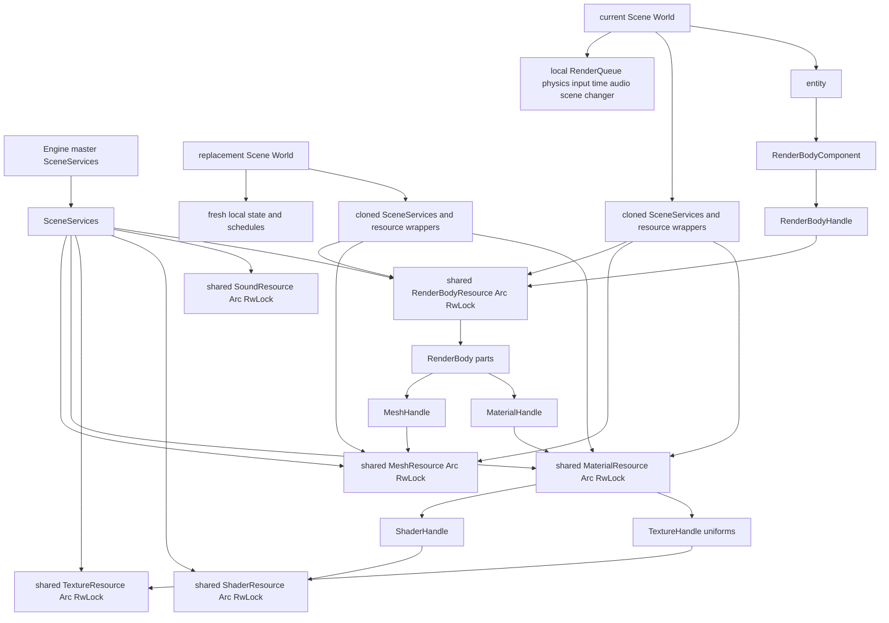

## Mental model

`Scene` is the replaceable gameplay container: it owns one Bevy ECS `World` plus two empty, game-owned schedules (`game_frame_schedule` and `game_simulation_schedule`). `Engine` owns the current `Scene` and a private master `SceneServices`; `Engine::new_scene()` is therefore the normal way to make a compatible new scene. A scene is **not** an isolated asset universe: its world gets cloned resource wrappers that point at the same stores held by the engine.

This deliberately separates two lifetimes:

- **Scene-local state** is created afresh by `Scene::new`: entities and their components, the two game schedules, `RenderQueue`, `ActiveCamera`, input, timing, world basis, gravity, physics working state, audio commands, and the pending scene-change slot. Replacing the scene discards this state with the old world.
- **Shared services** are built once in `Engine::new` and are injected both as the aggregate `SceneServices` resource and as individually queryable resources. Mesh, texture, shader, sound, render-body, and material resource clones all retain the same `Arc<RwLock<...>>` allocation, so their stored values and typed handles are usable by a subsequently constructed scene.

`RenderBodyResource` is shared alongside the conventional assets. This matters because an entity retains only a `RenderBodyHandle`; the render body, its mesh parts, and the material references must survive scene replacement together. There is no scene-replacement cleanup of these stores, so loading assets for successive scenes can grow the shared stores until callers explicitly remove entries where removal APIs exist.



*Scene worlds have fresh frame and gameplay state, while cloned wrappers connect their entities’ typed handles to the same shared render and asset stores.*

## Scene construction contract

`Scene::new(&SceneServices)` creates `World::new()`, stores a clone of the aggregate service, then inserts clones of each of its six individual resource wrappers. It also establishes the resources expected by the built-in schedules:

| Resource or state | Ownership and purpose at scene start |
| --- | --- |
| `SceneServices`, `MeshResource`, `TextureResource`, `ShaderResource`, `SoundResource`, `RenderBodyResource`, `MaterialResource` | Shared wrappers. Systems can request either `Res<SceneServices>` when they need the aggregate or a concrete resource for an individual store. |
| `RenderQueue` | Fresh per-frame staging vector. `RenderSystem::build_render_queue` clears and repopulates it from entities every frame. |
| `ActiveCamera` | Fresh `None` selection. The game must set it to a valid camera entity before normal rendering can proceed. |
| `InputStateResource`, `TimeResource`, `WorldBasis`, `Gravity`, `AudioControl` | Fresh scene-local input, timing, coordinate, gravity, and queued-audio state. `Scene::new` uses `TimeResource::new(60, 120)`, meaning a 60 FPS target and a 120 Hz simulation interval. |
| `PhysicsResource`, `CollisionFrameData`, `PhysicsFrameData` | Fresh broadphase/cache, collision, and solver frame data; they must not carry entity IDs across worlds. |
| `SceneChangerResource` | Fresh one-slot handoff mechanism for requesting the next `Scene`. |
| `game_frame_schedule`, `game_simulation_schedule` | Empty schedules for game registration; they are distinct from engine-owned frame, physics, and cleanup schedules. |

Do not construct a bare `World` as a substitute for a `Scene` when it will run under `Engine`: engine and built-in systems use `expect` for these resources. Add scene-specific systems to the scene’s schedules only after calling `Scene::new`, and populate its `world` with entities. The game sample demonstrates this pattern by receiving `Res<SceneServices>`, building `Scene::new(&services)`, populating it, and passing it to `SceneChangerResource::request_change`.

### Replacement lifecycle

A scene change is deferred rather than mutating the engine’s current scene mid-system:

1. A system obtains `ResMut<SceneChangerResource>` and calls `request_change(scene)`. If a request is already pending, the newer scene replaces it and a warning is logged.
2. At the end of a rendered frame, the engine takes the pending scene from the current world. If present, it assigns `self.scene = pending_scene`.
3. The engine resets and rebuilds its frame, physics, and cleanup schedules because Bevy schedules are bound to the world in which they were used. The replacement scene’s own game schedules are already part of the `Scene` value and run with the new world.

The scene switch happens after cleanup and buffer swapping. Consequently, code that holds old `Entity` IDs, `ActiveCamera` selection, collision caches, or pending audio commands must not expect them to transfer. Keep cross-scene identity in game-owned data rather than old-world entity handles; keep reusable asset identity in the shared typed handles.

## Entities, components, and resources

Use a **component** for data that belongs to one entity and is selected through a query; use a **resource** for singular world-level state or service access. The engine’s component module includes rendering, camera/transform, collision/physics, velocity/sleep, audio source/listener, and event-listener roles. Bevy `#[require(...)]` declarations encode several important composition contracts:

- `TransformComponent` holds position (`Vec3`), rotation (`Quat`), and scale (`Vec3`). It is required by `CameraComponent`, `RenderBodyComponent`, `AudioSourceComponent`, and `VelocityComponent`.
- `CameraComponent` holds projection parameters only—vertical FOV in radians, aspect ratio, near, and far—not a view transform. Its entity needs a transform. `ActiveCamera` is a resource containing `Option<Entity>`, not a component, so the application explicitly selects the camera used for rendering.
- `RenderBodyComponent` ties an entity to a shared `RenderBodyHandle`; its transform supplies the entity/world transform. `MaterialComponent` separately exists as a direct material-handle component, but the render queue currently obtains a material from each `RenderBodyPart` rather than querying `MaterialComponent`.
- `PhysicsComponent` classifies a body as `Static`, `Dynamic`, or `Kinematic` and supplies mass, friction, drag, restitution, and inertia. It requires both transform and velocity. `SleepComponent` carries configurable thresholds/timer, and `PhysicsEventListenerComponent` is an opt-in marker for physics events.
- `AudioSourceComponent` stores a `SoundHandle`, volume, pitch, and looping flag and requires a transform; the built-in spatial-audio systems use changed transforms to update source position. `SingleAudioListenerComponent` marks a listener, but multiple such entities are an error condition: the system logs an error and uses only the first changed listener.

The requirement attributes express data dependencies; they do not make a malformed handle valid. In particular, inserting a render component with a handle not present in the shared body store will fail when the render queue is built.

## Spatial conventions and transforms

`WorldBasis::canonical()` defines a normalized, right-handed basis with **Z up** and **negative Y forward**. It derives `right` as `forward.cross(up)`. `Scene::new` inserts this canonical value and `Gravity::default()` is directed opposite canonical up at magnitude `9.81`. Game systems should obtain `Res<WorldBasis>` rather than hard-coding axes, especially when deriving movement, camera, or gravity-relative directions.

`TransformComponent::to_mat4()` builds a matrix as:

```text
translation * rotation * scale
```

That same matrix is the entity/world transform used by rendering, motion, and collision calculations. When building the render queue, the engine multiplies the entity matrix by each `RenderBodyPart.local_transform`; each generated `RenderInstance` therefore has `entity_world * part_local`. A transform’s inverse becomes the view matrix for an active camera; if inversion fails, the runtime substitutes `Mat4::IDENTITY`.

### Camera caution

`CameraComponent::projection_matrix()` calls `Mat4::perspective_rh(fov_y_radians, aspect_ratio, near, far)`. However, the currently used `Engine::build_camera_render_data` directly calls `Mat4::perspective_rh` with `aspect_ratio` in the first argument and `fov_y_radians` in the second. It uses the camera-specified aspect when it is positive, otherwise the window-width/window-height fallback. Because the runtime path—not `projection_matrix()`—feeds the renderer, this argument order discrepancy is a rendering defect to correct and cover with a focused camera-matrix test before relying on custom camera settings.

## Handles, stores, and render resolution

`slotmap::new_key_type!` defines separate opaque key types: `MeshHandle`, `MaterialHandle`, `TextureHandle`, `ShaderHandle`, `SoundHandle`, and `RenderBodyHandle`. Each corresponding storage is a `SlotMap<Handle, Value>`, so a mesh key is not interchangeable with a material or render-body key. `add_*` returns a handle; lookups return `Option`, making absence representable at the storage boundary.

A `RenderBody` consists of `RenderBodyPart` values, each with a mesh handle, material handle, and local matrix. The per-frame resolution path is:

1. `RenderSystem::build_render_queue` queries `(TransformComponent, RenderBodyComponent)`, clears the local queue, resolves the body, and emits one `RenderInstance` per part.
2. An instance retains the resolved mesh/material handles and the combined transform.
3. The renderer stages those instances, requires a camera, culls against mesh bounding spheres, batches visible work by material then mesh, resolves the material’s shader and uniform values (including texture handles), and draws instanced geometry.

This is an indirection boundary, not reference-counted asset ownership. Missing render bodies cause `build_render_queue` to panic; missing mesh, material, or shader entries likewise panic in rendering/culling. Removing a live entry can therefore break entities and renderer caches that still reference its handle. Make removal a coordinated operation: despawn or retarget dependent entities, remove body/material relationships as appropriate, then remove the underlying asset. `MeshStorage::remove_mesh` additionally asks the renderer to delete its GPU data when a mesh was actually removed.

All six shared wrappers expose `read()` and `write()` guards over `Arc<RwLock<Storage>>`. A poisoned lock does not propagate a panic through these accessors: each logs an error and recovers the inner value with `into_inner()`. This supports shared access but does not eliminate lock contention or repair an invariant violated by the thread that poisoned the lock; keep write critical sections short and avoid holding a store guard while calling code that may need the same store.

Shader storage also caches handles by its vertex/fragment source-path pair: `get_or_load` returns the cached handle when available and otherwise builds and stores a new shader. Sound storage has an additional name-to-handle map, while material descriptions reference a shader plus named uniform values, which may include texture handles.

## Operating and extending scenes safely

1. Construct the engine, then load reusable models, textures, shaders, or sounds through its APIs or the injected shared resources. A model loader creates meshes/materials and finally returns a `RenderBodyHandle`; retain that handle for entities or colliders.
2. For each scene, use `Engine::new_scene()` or `Scene::new(&services)`. Register game frame/simulation systems and spawn entities into that scene’s world. Create a camera entity and set `ActiveCamera`; without an active, queryable camera, the renderer clears/restores the viewport and returns without drawing instances.
3. For a switch, fully initialize the new scene before calling `request_change`. The current system continues running against the old world until the end-of-frame handoff.
4. When extending the initialization contract with a built-in system that requires a resource, insert a fresh scene-local resource in `Scene::new`; when extending a reusable service, add it to `SceneServices`, initialize it once in `Engine::new`, and clone/insert the wrapper in `Scene::new`. Update all three locations together.

The engine limits physics catch-up to six fixed steps and clamps excessive frame time, but those operational details do not change the ownership rule: physics resources and time are recreated per scene, while the asset wrappers persist. See [Engine Runtime](/openwiki/architecture/engine-runtime.md) for the complete loop ordering, [Physics and Collision](/openwiki/concepts/physics-and-collision.md) for collider usage, [Assets and Rendering](/openwiki/integrations/assets-and-rendering.md) for loaders and GPU work, [Audio and Spatial Sound](/openwiki/integrations/audio-and-spatial-sound.md) for emitter/listener behavior, and [Game Bootstrap and Scene Switching](/openwiki/workflows/game-bootstrap-and-scene-switching.md) for application setup.

## Focused verification

Run the engine suite with:

```text
cargo test -p engine
```

The existing `TimeResource` tests verify requested frame/simulation rates and the ECS system update path; gravity and movement tests verify the canonical-basis-dependent direction and transform integration helpers. Model-loader tests verify glTF image-format conversion, including rejection of unsupported formats. These are useful adjacent checks, but they do not substitute for a scene ownership smoke test.

When changing this area, add or maintain tests that construct `Scene::new` using one `SceneServices` value and verify: (1) every required local resource exists and starts fresh; (2) resource clones observe the same shared inserted asset/body; (3) a `RenderBodyComponent` produces one queue instance per body part with `entity_world * local_transform`; and (4) a queued scene replacement resets local `ActiveCamera`/physics state while the new world can still resolve the prior shared handle. A camera test should compare the runtime projection matrix against `CameraComponent::projection_matrix()`; it will expose the current argument-order mismatch described above.
