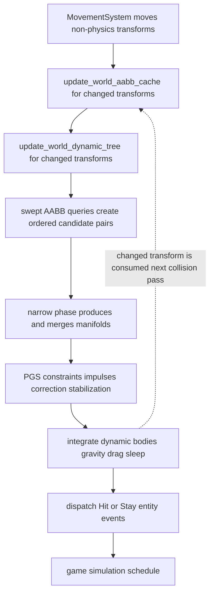

## Scope and mental model

Physics is an ordered, fixed-step ECS pipeline, not a general-purpose body hierarchy. A `Scene` owns fresh `PhysicsResource`, `CollisionFrameData`, `PhysicsFrameData`, `Gravity`, and fixed-step timing; scene replacement therefore discards broad-phase nodes, manifolds, and solver work along with its entities. The standard scene runs at 120 Hz, although all systems read `TimeResource::simulation_fixed_dt()` and a caller can change it.

There are two related but separate roles:

- A **collider** supplies collision geometry and must have a `TransformComponent`. `ConvexCollider` holds a local `ConvexShape`; `MeshCollider` references a shared `RenderBodyHandle` whose meshes supply triangle BVHs. Either collider can exist without `PhysicsComponent`, so collision detection and event production are not restricted to simulated bodies.
- A **body** has `PhysicsComponent`, which requires both transform and `VelocityComponent`. Its `PhysicsType` (`Static`, `Dynamic`, or `Kinematic`) plus mass, friction, restitution, linear/angular drag, and local inertia determine response and integration. `VelocityComponent` itself only requires a transform and stores world-space translational and angular velocity.

`PhysicsResource` is the persistent broad-phase state: a world-AABB map, `DynamicAabbTree`, and entity-to-leaf map. `CollisionFrameData` is the per-collision-pass product (candidate pairs, current manifolds, and previous manifolds); `PhysicsFrameData` is transient solver constraints and accumulated positional corrections.

## Fixed-step ordering is a behavioral contract

The engine chains the following functions in this exact order for every fixed step. The game simulation schedule runs only after this chain. The outer engine loop can execute zero to six fixed steps per rendered frame, clamps contributed frame time to 250 ms, and drops excess catch-up beyond one remaining fixed interval. This makes fixed-dt systems the correct integration point for gameplay that affects collision.



*The chained fixed-step path from transform motion through cached/tree AABBs, candidates, manifolds, response, integration, and listener-gated events.*

Two timing consequences are easy to miss:

1. `MovementSystem::update` runs first but deliberately excludes entities with `PhysicsComponent`; it directly translates and rotates non-physics velocity-driven entities. This is the intended transform-motion entry point for colliders that are not rigid bodies.
2. The cache, tree, and manifold producer queries are all filtered with `Changed<TransformComponent>`. A spawned transform qualifies, and transforms written by movement, solver correction, or body integration will qualify on a later collision pass until the engine clears change trackers at end of frame. An unmoved overlap is not independently rediscovered: `generate_manifolds` clears current data before looking at changed movers. External code that moves a static or kinematic collider must mutate its transform before this chain; changing collider fields, render-body assets, or velocity alone does not refresh its AABB/tree entry.

The cache is intentionally before the tree, and integration is intentionally after collision solving. Do not reorder these phases casually: the broad phase must see the updated world AABB before querying, and event payloads describe the manifold just solved, not an unspecified later state.

## Collider contracts and geometry boundaries

### Convex colliders

`ConvexShape` supports `Cuboid`, `Sphere`, `Triangle`, `TrianglePrism`, and `Egg`. Constructors expose cuboids/cubes, spheres, eggs, triangles, prisms, and AABB-derived cuboids/spheres. The `Collider` trait’s `aabb(&Mat4)` is the broad-phase boundary. A transform is composed as `translation * rotation * scale`; cuboid, triangle, prism, and egg AABBs are built by transforming local bounds’ eight corners. A sphere AABB uses its greatest transform-axis scale.

For generic convex narrow phase, `ConvexCollider::support` converts the world direction to local space, selects a local extreme point, and transforms it back. Tiny support-direction components are quantized to suppress nearly coplanar floating-point sign flips. GJK takes the Minkowski support of A in `dir` minus B in `-dir`, has a default cap of 32 iterations, and returns an intersection only with a tetrahedral simplex suitable for EPA. EPA expands that simplex with a 64-iteration cap and `1e-4` convergence tolerance to derive penetration and a normal.

Specialized paths are used where they are more direct:

- sphere–sphere uses center distance and one contact;
- cuboid–cuboid uses oriented-box SAT, supports rotation and scale, and selects at most four unique inside-vertex/support fallback contacts;
- other convex–convex combinations use GJK then EPA.

A material caveat: the specialized sphere–sphere narrow phase reads the collider radii directly, whereas the sphere AABB does apply transform scale. Its existing tests deliberately establish that scaling does **not** alter sphere–sphere overlap. Until that inconsistency is changed coherently, do not use entity scale as the physical radius for two spheres; encode the desired radius in `ConvexCollider::sphere` instead.

`CollisionLayer` is stored by both collider types and provides `Default`, `Player`, `Enemy`, and `Environment` labels. It is not consulted by the inspected broad- or narrow-phase path, so it does **not** currently implement collision masks, filtering, or trigger behavior. Add filtering explicitly before assuming layers suppress pairs.

### Mesh colliders

`MeshCollider::new(render_body_id, layer)` describes the shared render body rather than owning a copy of geometry. Its world AABB is the union of each referenced mesh AABB after the render-body part-local transform, then transformed by the entity. Missing body or mesh data makes that AABB unavailable, so cache/tree update skips the entity; narrow phase likewise produces no mesh contacts if the body, a part mesh, BVH, or inverse part world matrix is absent.

The supported mesh narrow phase is **convex versus mesh**, in either entity ordering. It resolves each render-body part as `entity_world * part.local_transform`, transforms the convex AABB into mesh space, and traverses the mesh BVH to select potentially overlapping triangles. Spheres use closest-point-on-triangle contact; all other convex shapes use a small-thickness triangle-prism proxy with GJK/EPA, then derive final depth from triangle-plane projection. Moving convex bodies also get a swept support-plane time-of-impact candidate pass against mesh triangles. Candidate reduction removes degenerate contacts, clusters nearby same-normal points, sorts deterministically by depth and coordinates, and retains at most four contacts.

There is no mesh–mesh branch. A pair for which both entities only have `MeshCollider` reaches no supported narrow-phase case and yields no manifold. Design static environment geometry as a mesh and active bodies as convex colliders; adding mesh–mesh response is a separate algorithmic extension, not a configuration change.

## Broad phase: changed AABBs, fat leaves, and deterministic pairs

For each changed collider transform, `update_world_aabb_cache` records the calculated tight world AABB. `update_world_dynamic_tree` performs the same calculation and creates or updates its leaf. Tree leaves are expanded by a fixed `0.1` in every dimension. On update, the tree retains an existing leaf when the newly expanded AABB is contained in the old fat AABB; otherwise it removes and reinserts the leaf, chooses a sibling by union-area cost, repairs enclosing bounds/heights, and rotates unbalanced subtrees. This margin deliberately trades occasional extra broad-phase candidates for fewer reinserts during small motion.

Manifold generation builds a mover’s swept AABB from its cached tight AABB and `VelocityComponent.translational * fixed_dt` when nonzero, queries the tree, excludes self, then canonicalizes every pair by entity bits, sorts, and deduplicates. The tree may report false positives due to broad bounds and fat leaves; narrow phase is the authority for contact. The pair ordering is not cosmetic: all manifold lookup and persistence use `ordered_pair(a, b)`, with the lower entity bits first.

The cleanup schedule observes removed `TransformComponent`s, removes their tree leaf if present, and erases the cached AABB. Removing only another component does not perform this cleanup. Conversely, tree bookkeeping is per collider transform: maintain the transform/removal lifecycle when adding custom collider component types.

## Manifolds, normal orientation, and continuity

A `Contact` contains ordered `entity_a`, `entity_b`, a world-space point, positive overlap depth, and a normal whose contract is **A → B**. This is enforced after all narrow-phase routines by `orient_contact_to_pair`: if a generated contact is reversed relative to `ordered_pair`, it swaps entities and negates the normal. EPA also orients result normals toward B from A when their centers are distinct. Do not change just one of these signs: response, resting-contact support logic, and per-entity events all rely on it.

At the beginning of `generate_manifolds`, `CollisionFrameData::clear` moves the last manifold vector into `previous_manifolds` and clears current candidates/manifolds. The current fixed dt is read separately for swept queries and narrow-phase calls. A new manifold is merged with its previous manifold to avoid contact churn:

- contacts are considered related only if their normal dot product meets the shape-specific threshold (`0.95` convex–convex, `0.9` convex–mesh) and their world points are within 1% of the smaller pair-AABB diagonal;
- when nearby contacts compete, the deeper penetration wins;
- if a cap is exceeded, contacts nearest previous points are preferred and penetration breaks ties;
- convex–convex manifolds cap at four contacts, while the intermediate convex–mesh merge permits eight, although mesh candidate reduction itself produces no more than four.

The manifold normal is the normalized penetration-weighted sum of retained contact normals. If concurrent candidate paths return another manifold for the same ordered pair, the system keeps the one with more contacts or, on equal count, greater maximum penetration. Narrow-phase candidate pairs run through Rayon in parallel, then their results are merged serially.

## Response, integration, and sleep

`PhysicsSystem::physics_solver` turns every manifold contact into a fresh `ContactConstraint`, then applies projected Gauss–Seidel (PGS) iterations. The iteration count is `simulation_fixed_dt().as_millis()`—at the standard 120 Hz scene rate this truncates to 8. Changing the fixed dt therefore also changes convergence; a duration below one millisecond yields zero PGS impulse iterations. Constraints are rebuilt each pass, so the normal/tangent accumulated lambdas warm-start only within that one solver invocation, not across frames.

For each valid constraint, response follows the A → B normal convention:

- only `Dynamic` bodies with positive mass receive nonzero inverse mass and inverse local inertia; `Static`, `Kinematic`, missing-physics entities, and zero/nonpositive-mass bodies are immovable to the solver;
- separating relative normal velocity returns early; otherwise normal impulse is nonnegative and applies equal/opposite linear and angular changes at the contact offsets;
- restitution is the smaller material restitution, but only when closing normal speed exceeds `0.1`;
- friction is `sqrt(friction_a * friction_b)` and its accumulated tangent impulse is clamped by the normal impulse (Coulomb bound).

After velocity impulses, positional correction ignores the first `0.025` penetration, distributes 45% of the remainder by inverse mass, accumulates per-body offsets, and clamps each applied offset to length 2.0. Resting-contact stabilization treats `-gravity.normalize()` as up (with `+Z` fallback), uses the normal orientation to identify the body supported along `-normal` for A and `+normal` for B, and applies extra damping only to nearly resting dynamic bodies on a sufficiently upward-facing support.

`integrate_motion` only advances `Dynamic` physics bodies. An awake body receives gravity first, then position/rotation integration, then simple velocity-proportional linear and angular drag divided by mass. Supplying a dynamic body with zero mass is unsafe: while solver inverse mass becomes zero, integration still divides drag by `physics.mass`. Keep dynamic mass finite and greater than zero and ensure `local_inertia` is meaningful; singular inertia safely resolves to zero inverse inertia in the solver.

Adding `SleepComponent` opts a dynamic body into sleep. Its defaults are 0.05 linear/angular thresholds and 0.5 seconds. An already-sleeping body has both velocities zeroed and skips integration. Otherwise, remaining below both thresholds increments the timer; reaching the configured duration marks it asleep and zeros velocities, while motion above either threshold resets the timer. There is no collision-driven wake-up path in the inspected systems: external gameplay must clear `is_sleeping` when it intentionally reactivates a body.

`Static` and `Kinematic` bodies are not integrated and have zero solver inverse mass. To move either, write its transform externally so the change-driven collision pipeline updates it. To create transform-driven kinematic motion without a `PhysicsComponent`, give the entity a velocity and let `MovementSystem` move it; that choice also means it is not a simulated, solver-responsive body.

## Collision events and impact audio

After integration, `dispatch_physics_events` walks current manifolds. A manifold absent from `previous_manifolds` emits `PhysicsEventType::Hit`; one whose ordered pair existed previously emits `Stay`. There is no `Exit` variant or event. Events are created separately only for endpoints carrying `PhysicsEventListenerComponent`, so the marker is an opt-in performance boundary rather than a collision requirement.

Each event is an entity-targeted Bevy event triggered through `Commands` and includes the recipient entity, other entity, event type, cloned contacts, relative normal speed, impact impulse, and impact energy. The A recipient receives the manifold normal; B receives its negation. Thus both recipients observe a normal pointing from themselves toward the other body. A gameplay consumer must register the appropriate Bevy entity-event observer; the marker by itself does not contain callback behavior.

Impact metrics are calculated when the manifold is produced, before the solver: approach speed is clamped from relative translational velocity projected on the manifold normal; impulse is reduced mass times that speed; energy is one half reduced mass times speed squared. They are descriptive impact values, not necessarily the final PGS impulse.

`SimplePhysAudioSystem::on_hit_audio_system` independently uses the same prior-manifold test during the engine's once-per-render-frame schedule. On `Hit` only, each endpoint with `SimpleOnHitAudioComponent` queues a one-shot at the mean contact point; volume is its configured volume times clamped `impact_energy * force_volume_scale`. Because audio runs before the frame's fixed steps, it consumes collision data left by earlier simulation, rather than same-step events.

## Safe extension checklist

- **Preserve the schedule chain and tracker boundary.** A system that changes a collision transform belongs before cache/tree/manifold generation if it must affect that pass. Keep removal cleanup before `World::clear_trackers()`.
- **Preserve canonical orientation.** Store every manifold/contact under `ordered_pair`, with normal A → B, and negate it only for B-facing event payloads. Test both entity orderings for each new narrow-phase route.
- **Update tight cache and broadphase consistently.** A new collider type needs both world-AABB calculation and tree lifecycle support; do not make candidate generation depend on stale AABBs.
- **Make pair capability explicit.** Current support is convex–convex and convex–mesh, not mesh–mesh; collision layers are labels, not filtering. Add tests and explicit decisions for new pair combinations or filters.
- **Bound and stabilize contacts.** Maintain deduplication, deterministic ordering, manifold persistence, and appropriate contact caps. Adding raw triangle contacts directly can destabilize solver cost and event/audio payloads.
- **Keep body values physical.** Dynamic mass must be positive and finite; choose inertia, friction, restitution, and drag deliberately. Review the PGS iteration coupling whenever changing the fixed rate.
- **Wake sleeping bodies intentionally.** Any gameplay impulse/teleport mechanism should define whether it clears `SleepComponent::is_sleeping`, otherwise the integrator will zero the velocity again.

## Focused verification

Run the physics/unit suite with:

```text
cargo test -p engine
```

The most relevant tests are colocated with the implementation:

- `collider_component.rs` checks transformed support points and zero-direction behavior;
- `gjk.rs` exercises overlap, separation, rotated/non-uniform shapes, touching and nearly coplanar edge cases, and the tetrahedron requirement for EPA;
- `epa.rs` checks penetration and A-to-B normal orientation including deep and near-touching cases;
- `collision_system.rs` covers convex/mesh contacts, normal direction, reduction to four contacts, rotated/scaled cuboids, and manifold continuity snapshots;
- `dynamic_aabb_tree.rs` validates insertion/removal, fat-AABB in-place versus reinsertion updates, query correctness, rotations, randomized stress, and height/parent/AABB invariants.

For allocation-sensitive changes, run the integration profiling tests under the feature that enables `dhat`; `dynamic_aabb_tree_heap_test.rs` expects no additional allocations after warm-up during repeated updates/queries, while `epa_heap_test.rs` expects no additional allocations after the initial EPA operation. Use `cargo bench -p engine` to compare the 1024-object broad-phase update and 512-object convex-contact benchmarks.

Before merging a physics change, add a focused test for the contract it changes: changed-transform detection and cleanup for cache/tree work; pair ordering and normal signs for a narrow phase; manifold carry-over and contact cap; static/dynamic/kinematic response and sleep/wake behavior; and `Hit`/`Stay` dispatch to both listener endpoints. See [Engine Runtime](/openwiki/architecture/engine-runtime.md) for frame/fixed-step execution, [ECS Scene, Components, and Shared Resource Ownership](/openwiki/concepts/ecs-scenes-and-resources.md) for scene resource lifetimes, and [Audio and Spatial Sound](/openwiki/integrations/audio-and-spatial-sound.md) for queued audio ownership.
