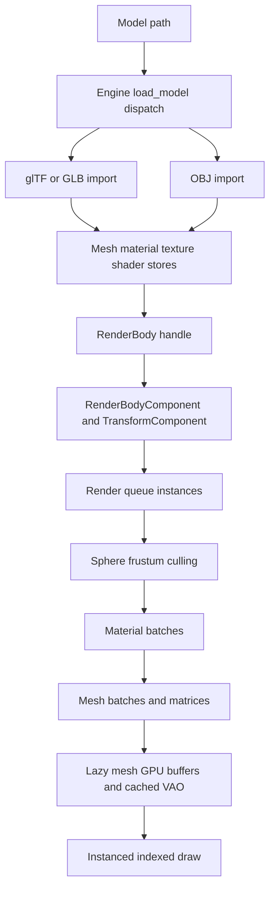

# Asset Import and OpenGL Rendering

The asset boundary turns on-disk model data into reusable, slot-map handles, rather than attaching raw geometry to entities. A loaded model becomes a `RenderBodyHandle`; an entity becomes visible only when it pairs that handle in `RenderBodyComponent` with its required `TransformComponent`. The scene owns ECS resources that point, through `Arc<RwLock<_>>`, at engine-created mesh, texture, shader, material, render-body, and sound stores. Consequently, `Engine::new_scene()` creates a fresh ECS world and render queue while retaining the same underlying asset stores across scenes.

## End-to-end render path



*Model loading produces shared handles, while each frame expands entity references into visible material-and-mesh batches for OpenGL instancing.*

At startup, `Engine` creates the SDL OpenGL context and a `Renderer`, then initializes the shared services. The context is requested as forward-compatible OpenGL core 3.3 with a 24-bit depth buffer. `Scene::new` installs clones of those services in its world plus a scene-local `RenderQueue`. This is an ownership boundary worth preserving: resources are lookup stores, whereas entities hold only handles.

Each frame, the chained frame schedule first runs `RenderSystem::build_render_queue`; the engine then builds camera data, copies the queue to the renderer, and calls `Renderer::render` while holding read locks on the four graphics stores. Rendering occurs before fixed-step simulation. If there is no valid active camera, the renderer has already cleared the buffers and set the viewport, then restores the previous viewport and returns without drawing.

`build_render_queue` clears its previous contents, queries every `(TransformComponent, RenderBodyComponent)`, resolves the referenced body, and emits one `RenderInstance` per part. Its transform is `entity_world_transform * part.local_transform`. A missing render-body handle is a panic, so components must refer to a live body. Current importers set every part's local transform to identity; glTF mesh primitives are flattened and do not preserve glTF node or scene transforms.

## Model import contract

### Dispatch and failure behavior

`Engine::load_model(path)` lowercases the final filename extension and dispatches as follows:

| Extension | Current behavior |
| --- | --- |
| `.gltf`, `.glb` | Imports with the `gltf` crate and returns `Some(RenderBodyHandle)` on the successful path. |
| `.obj` | Imports with `tobj`, constructs mesh/material parts, and returns `Some(RenderBodyHandle)` on the successful path. |
| `.fbx` | Reaches `load_fbx`, which is explicitly `unimplemented!`; it panics rather than returning an unsupported result. The repository includes `resources/models/building.fbx`, but it is not loadable through this path. |
| Anything else, missing extension, or non-UTF-8 extension | Logs a warning and returns `None`. |

The `Option` therefore only represents extension rejection. Most errors after a recognized extension are fail-fast: OBJ loading uses `expect`, glTF mesh import is unwrapped, glTF material loading is expected, and required world resources are expected. Callers should validate authoring inputs and handle `None` for dispatch rejection; they cannot rely on `load_model` to report malformed supported files as `Err`.

### glTF and GLB

For each primitive of every glTF mesh, the importer builds the engine `Vertex` layout (`position`, `normal`, `barycentric`, `uv_albedo`, `uv_normal`, `tangent`) and indexed `Mesh`. `POSITION`, `NORMAL`, `TEXCOORD_0`, and indices are mandatory: a missing one makes the primitive conversion fail and the outer `load_gltf` path panics. Tangents are optional; missing tangents produce a warning and are calculated from positions, normals, UVs, and indices. Length assertions require those arrays and tangents to align.

The importer calculates an AABB, derives a bounding sphere from that AABB, and builds a triangle BVH with maximum leaf size 8. Those are not merely render metadata: the sphere drives renderer culling, and mesh AABBs/BVHs are available to mesh-collider physics. `Engine::aabb_from_render_body` unions part AABBs after their local transforms, while `mesh_collider_from_render_body` ties collision to the same `RenderBodyHandle`. See [Physics and Collision](/openwiki/concepts/physics-and-collision.md) for the collision lifecycle.

Material conversion intentionally implements a small PBR subset:

- one `pbr.vert`/`pbr.frag` shader handle is acquired from the shader cache;
- roughness is `pbr_metallic_roughness().roughness_factor()`;
- base-color texture is used when present, otherwise a 1×1 RGBA texture is made from `base_color_factor`;
- normal texture is used when present, otherwise a shared-per-import flat normal `[128, 128, 255, 255]` is used;
- metallic factors, occlusion/emissive textures, alpha modes, samplers, and other glTF material features are not translated into the engine material parameters.

Every glTF texture is converted to RGBA and immediately uploaded. Only `R8`, `R8G8`, `R8G8B8`, and `R8G8B8A8` image data are accepted; other `gltf::image::Format` values cause material loading to fail, which `load_gltf` turns into a panic. The material list must contain at least one material: the loader selects its first generated handle as the fallback and panics if none exists. A primitive with no material—or with an out-of-range material index—uses that first material.

### OBJ

OBJ loading requests `single_index: true`, constructs a part for each `tobj` model, and resolves texture filenames relative to the OBJ parent directory. It flips the V coordinate for supplied UVs. Missing normals are filled with `[0.0, 0.0, 1.0]`; missing UVs with `[0.0, 0.0]`; tangents are computed only when both are supplied, otherwise every tangent is `[1.0, 0.0, 0.0, 1.0]`. It also computes bounds and a BVH as for glTF.

OBJ material data maps diffuse texture or diffuse color to albedo, normal texture to normal, and derives roughness from shininess as `clamp(1 - shininess / 1000, 0, 1)` when shininess is positive. Missing texture entries become solid fallback textures: white/default diffuse for albedo and flat normal for normals. If OBJ material loading yields no usable materials, the loader installs that same white/flat-normal default. A model part with no valid material ID uses the first generated material.

### Shared stores and handles

`MeshResource`, `MaterialResource`, `TextureResource`, `ShaderResource`, and `RenderBodyResource` each wrap a `SlotMap` store in `Arc<RwLock<_>>`; their typed slot-map keys prevent confusing mesh, material, texture, shader, sound, and render-body references. Their `read()`/`write()` helpers log a poisoned-lock error and recover the inner value, rather than propagating lock poisoning.

A `RenderBody` is a vector of `{ mesh_id, material_id, local_transform }` parts. This permits multiple entities to instance the same imported parts with different entity transforms. Mesh removal is the one explicit graphics cleanup path: `MeshStorage::remove_mesh` removes the CPU mesh and calls `Renderer::delete_mesh_gpu` for its VBO, EBO, and instance buffer. Material, texture, shader, and render-body store removal does not provide analogous GPU disposal in the shown implementation, so asset lifetime changes need an explicit cleanup design.

## Shader, material, and texture contracts

`Material` is a shader handle plus an ordered vector of named `UniformValue`s. Values can be float, `Vec3`, `Mat4`, integer, or a texture handle assigned to a texture unit. The standard import path creates the following PBR material parameters:

```text
u_roughness          Float
u_base_reflectance   Float(0.04)
u_albedo             Texture unit 0
u_normal             Texture unit 1
```

`ShaderStorage::get_or_load` caches a program by the vertex-and-fragment path pair. On first use, `Shader::new` reads both files, compiles, links, and introspects active uniforms and attributes. File-read failures, invalid UTF-8 path conversion, shader compilation failures, program link failures, and several OpenGL object-creation `unwrap`s are panic-based failures—not recoverable asset-load diagnostics. The shader cache means subsequent imports using the same two paths reuse the program handle.

The renderer only sets a uniform when it was introspected as active. Thus a material parameter whose name is optimized out or absent is silently ignored. Before material parameters, it conditionally supplies the frame uniforms `u_view_proj`, `u_camera_position`, `u_light_direction`, and `u_light_color`. The current renderer supplies a fixed light direction `(0, 0, 1)` and white light color; it has no scene-light query.

The bundled PBR shaders establish the active layout contract:

- Per-vertex attributes must use the `Vertex` field names: `position`, `normal`, `barycentric`, `uv_albedo`, `uv_normal`, and `tangent`.
- An attribute name beginning `instance_` is classified as per-instance by reflection. The VAO builder recognizes only `instance_model_col0` through `instance_model_col3`, binding four `vec4` columns from 64-byte matrices with divisor 1.
- `pbr.vert` transforms position, normal, and tangent with the instance model matrix and constructs a TBN basis; `pbr.frag` samples `u_albedo` and `u_normal` and applies a direct-plus-ambient microfacet-style PBR calculation.

A custom shader can use recognized vertex fields and the four instance-matrix names to participate in the existing renderer. Other reflected attributes are not bound by the VAO builder. Texture material parameters bind exactly their requested units, but renderer cleanup unbinds units `0..textures_bound`; custom materials should therefore use contiguous texture units starting at zero to match that cleanup assumption.

Textures are not lazy: file images, solid fallbacks, and decoded glTF images are uploaded on creation. Uploads use a 2D RGBA unsigned-byte texture, repeat wrapping, generated mipmaps, and mipmap-linear filtering, then retain the OpenGL texture object in `Texture.gl_tex`. `TextureStorage::load_from_file` panics if the `image` crate cannot open the image. There is no file-path texture cache, so repeated loads create separate texture-store entries and GPU textures.

## Culling, batching, and GPU draw lifecycle

The renderer persists reusable vectors for staged input instances, visible instances, matrices, and batch ranges. Per render call it:

1. enables depth testing and back-face culling, clears color/depth, and sets the requested viewport;
2. derives six normalized planes from the camera view-projection matrix;
3. culls each instance against the mesh bounding sphere transformed into world space, scaling radius by the maximum length of the transform's three basis axes;
4. sorts surviving instances by `(material_id, mesh_id)` and records contiguous material ranges, mesh ranges, and column-major model matrices;
5. binds each material's shader and uniforms once, then draws each mesh batch.

This ordering reduces program/material state changes and draws all instances that share both material and mesh using `gl.draw_elements_instanced`. The batch vectors are cleared and reused, so the intended steady-state path avoids allocations after their capacities have grown. A missing mesh during culling or drawing, missing material, missing shader, or missing texture is a panic, establishing a strict referential-integrity invariant across stores.

Mesh GPU resources are deliberately lazy. `get_or_create_vao` keys the VAO cache by `(MeshHandle, ShaderHandle)` and, on the first draw of a mesh, creates and uploads a static vertex buffer, static index buffer, and initially empty dynamic instance buffer. It then builds the VAO from reflected shader attributes. Every batch replaces the mesh's dynamic instance-buffer contents with that batch's matrices and issues the indexed instanced draw. Thus CPU model import does not upload mesh VBO/EBO data until the mesh survives culling and is actually drawn; texture and shader creation are earlier, eager boundaries.

## WAV-adjacent asset boundary

Audio is separate from render assets but uses the same handle-store pattern. `Engine::load_wav(path)` obtains the audio mixer's sample rate, decodes through `Sound::from_wav`, and inserts a `Sound { sample_rate, channels, data: Arc<[f32]> }` in `SoundResource` under the basename of the path. The engine later passes the sound store to the audio mixer when it consumes queued commands.

The apparent `Result<SoundHandle, String>` currently returns `Ok` after insertion; decoding failures do not become `Err`. Opening a WAV, converting individual samples, unsupported channel counts, and malformed stereo frame count use `unwrap`, `panic!`, or `assert!`. Only one- and two-channel WAVs using `i16` samples are supported. Samples are normalized to floats and, if necessary, linearly resampled to the mixer rate; stereo is interpolated channel by channel. The name map can overwrite a prior basename-to-handle entry, while the old sound remains in the slot map.

For the audio system and scene control boundary, see [ECS Scenes and Resources](/openwiki/concepts/ecs-scenes-and-resources.md) and [Game Bootstrap and Scene Switching](/openwiki/workflows/game-bootstrap-and-scene-switching.md).

## Operations and focused validation

Run the focused CPU-side checks from the workspace root:

```bash
cargo test -p engine
```

The asset tests currently verify AABB derivation and bounding-sphere computation, plus conversion of the four accepted glTF image formats and rejection of `R16`. They do not exercise an OpenGL context, full model import, render-queue construction, culling, VAO reflection, batching, or instanced draw. Changes to those paths should be validated interactively with the sample assets—`resources/models/cube/Cube.gltf` and `resources/models/sphere_low/sphere.obj` are loaded by the game—and should add context-aware or pure extraction tests before relying on the renderer in automation.

For broader test and performance guidance, see [Validation and Performance](/openwiki/testing/validation-and-performance.md).
