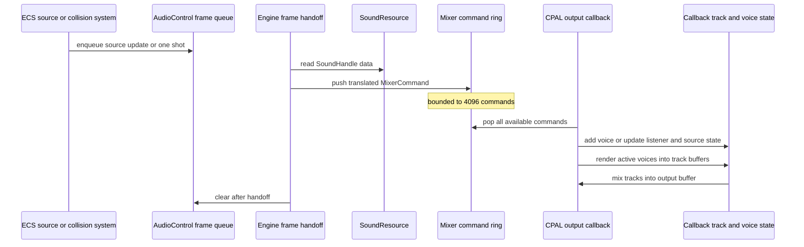

## Scope and ownership

Audio is split at a deliberate thread boundary. Gameplay and engine ECS systems write high-level requests to the scene-local `AudioControl` resource. After the frame's game and fixed-simulation work, `Engine` resolves sound handles from the shared `SoundResource` and pushes compact `MixerCommand`s through an `rtrb` ring buffer. The CPAL output callback consumes that buffer and exclusively owns the mutable mixer state: 32 tracks, their voices, listener information, and the entity-to-source-position map.

This means gameplay should **not** manipulate `Track`, `Voice`, or CPAL directly. It should load a sound, keep its `SoundHandle`, attach the appropriate components, or borrow `ResMut<AudioControl>` in an ECS system. `AudioControl` is recreated with every `Scene`, whereas `SoundResource` is an `Arc<RwLock<SoundStorage>>` shared by the engine's scene services; loaded sounds and handles can therefore be reused by a replacement scene.



*An ECS command is transferred once per rendered frame and then applied by the callback-owned mixer state on a later audio callback.*

The order has observable consequences:

- The chained engine frame schedule first detects newly added emitters, then listener/source transform changes and removed sources, then collision-hit sounds. Game frame systems run after that chain; fixed game systems run later in each eligible physics step. All commands accumulated by those stages are handed off once, after the fixed-step loop.
- Cleanup clears `AudioControl` **after** that handoff, then the world clears Bevy change trackers. Requests are frame-owned, not persistent commands: an unrecognised/missing sound request is logged during translation and is still cleared; there is no retry queue.
- The handoff and callback are asynchronous. A successful ring-buffer push means the callback will apply the command when it next processes its input, not that the sound has already reached the device.

For the wider scheduling contract, see [Engine Runtime](/openwiki/architecture/engine-runtime.md), and for scene-local versus shared resource lifetime, see [ECS Scene, Components, and Shared Resource Ownership](/openwiki/concepts/ecs-scenes-and-resources.md).

## Loading and resolving sound assets

`Engine::load_wav(path)` reads the default CPAL output sample rate from the private mixer, decodes the WAV immediately, and adds it to `SoundResource`. A `Sound` retains its sample rate, original channel count, and an `Arc<[f32]>` sample buffer; `SoundStorage` assigns a typed `SoundHandle` from a `SlotMap` and also maps the path file name to that handle. Gameplay can retain the returned handle or resolve a name with `SoundResource::read().get_by_name(...)`.

The loader is intentionally narrow and synchronous:

- It accepts only one- or two-channel WAV input. Other channel counts panic with `Unsupported number of channels`.
- Samples are read as signed 16-bit values, normalized by `32768.0`, and linearly resampled to the device sample rate when needed. Mono is resampled sample-by-sample; stereo preserves paired left/right frames. It does not support a streaming decoder, another source sample type, or arbitrary channel layouts.
- Open/decode/sample errors are unwrapped, so a bad path or incompatible WAV can panic despite `load_wav` returning `Result<SoundHandle, String>`.
- The mixer construction itself expects a default output device, default output configuration, stream creation, and stream playback to succeed. It uses that configuration's sample rate and channel count, so startup is not a no-audio fallback mode.

Use mono source material for a world-positioned effect. Stereo sources are accepted, but their existing channel image is additionally attenuated and panned by the spatial path; the sample game explicitly treats this as likely to sound odd. The `pitch` fields on `AudioSourceComponent` and `SimpleOnHitAudioComponent` are currently not transferred to `MixerCommand` or used by `Voice`, so setting them does not alter playback rate or pitch.

## Gameplay entry points

### Direct control commands

`AudioControl` provides public methods for:

- `play_one_shot(track, sound, volume)` for a non-looping voice without a location;
- `play_one_shot_at_location(track, sound, volume, location)` for a non-looping positionally processed voice;
- `mute_track` / `unmute_track`, `pause_mix` / `resume_mix`, and `mute_mix` / `unmute_mix`.

Every command retains the caller-supplied `u8` track number. The callback has exactly 32 tracks (`0..32`); `AddVoice` and track mute commands whose index is outside that array are ignored when processed. There is no track-name layer or validation error for such an index.

At translation, a spawn or one-shot resolves the handle. If found, the mixer clones the sound's `Arc` and sends it with volume, looping choice, source channel count, optional source entity, and optional static location. A missing handle prints an error and produces no voice. All ring-buffer `push` calls use `expect`: the fixed 4096-command producer queue being full panics with `Audio mixer command queue is full! Sorry.` rather than dropping, blocking, coalescing, or deferring the command. Treat command bursts as a process-stability concern until this policy is changed.

### Persistent entity emitters and listener updates

Attach `AudioSourceComponent { sound, volume, pitch, looping }` to an entity. It requires a `TransformComponent`. On the frame in which the audio-source component is *added*, `AudioCommandQueueSystem` queues a looping or non-looping spatial emitter on track 0. Updating component fields later does not recreate or update the voice; only the component-added query creates it.

`SpatialAudioSystem` observes changed transforms and queues:

- a listener position and rotation for an entity that has `SingleAudioListenerComponent`;
- a source position for a changed transform that also has `AudioSourceComponent`; and
- `RemoveSourceInfo` for a removed audio-source component.

The listener query includes only **changed** listener transforms. If more than one such entity is found in that frame, it logs an error and sends the first iterator result only; it does not establish a stable listener selection or combine listeners. If no listener update has ever reached the callback, voices with locations receive no positional attenuation/pan calculation. A listener that has not changed simply leaves the callback's last listener information in place.

Removal is a narrower operation than the name suggests: `RemoveSourceInfo` only deletes the entity's entry from the callback source-position map. It does **not** remove its `Voice` from a track. A removed non-looping source can continue until its samples end; a removed looping source continues indefinitely, but no longer resolves an entity location and consequently falls back to non-positional center/no-distance behavior. Despawning or removing a source is therefore not currently a stop-emitter API.

## Collision-hit sounds

`SimpleOnHitAudioComponent` is a separate one-shot policy, not a persistent emitter. For every manifold in `CollisionFrameData`, `SimplePhysAudioSystem::on_hit_audio_system` classifies the ordered entity pair as `Hit` when it was absent from `previous_manifolds`; it skips `Stay`. For each endpoint carrying this component, it queues a track-0 `play_one_shot_at_location` using:

- the arithmetic mean of the manifold contact points as the sound location; and
- `component.volume * clamp(impact_energy * force_volume_scale, 0.0, 1.0)` as volume.

Thus one collision can create two one-shots when both entities have the component. This system runs once per rendered frame in the engine frame schedule, **before** the current frame's fixed physics loop. It consumes manifold data left by earlier fixed simulation rather than the collision work about to run; see [Physics, Collision Detection, and Events](/openwiki/concepts/physics-and-collision.md) for how current and previous manifolds are produced. As with persistent sources, the collision component's `pitch` field is inert today.

## Callback mixing model

The CPAL callback starts by draining all available mixer commands, so listener/source state and new voices are applied before that callback's render. On a pause command, it fills the output with zero and returns before rendering tracks, which freezes voice cursors. Global mute is different: tracks still render and voices advance, then the final output receives zero gain. Track muting likewise zeros that track's contribution while its voices continue advancing.

Each active track clears its scratch buffer, asks every voice for the callback's required number of frames, sums the returned stereo/mono samples with the track volume and mute gain, then removes finished voices with `swap_remove`. The callback sums active track buffers into the device output, duplicates a mono track's channel zero where needed, applies global mute gain, and clamps each final sample to `[-1.0, 1.0]`. There is no limiter other than this hard final clamp, no bus routing, and no exposed per-track volume or play-state control.

The implementation preallocates voice vectors for 256 entries per track but does not enforce that as a maximum. It allocates track scratch buffers for `4096 * device_channels` samples and voices size their initial buffer from a callback's output length. Consequently, avoid assuming arbitrary callback block sizes or multichannel device layouts are robust: voice output is always stereo, while the track copy indexes a non-mono voice by the device channel index. Device output above two channels is not handled safely by this path, and a callback requiring more than 4096 frames can exceed the fixed track buffer.

## Spatial processing: what it does and does not model

A `Voice` always produces a stereo buffer. Its effective location is the fixed one-shot location, overridden by the current callback source-map position when it has an entity source. With both a location and listener state, it computes distance attenuation as `1.0 / (1.0 + distance² / 5.0)`, pan from the direction dot the listener's rotated `Vec3::X` right axis, and a forward-alignment value from the rotated `Vec3::Z` axis. Without both values, attenuation remains 1 and pan remains centered.

Pan is smoothed over a nominal 0.05 seconds using the voice sample rate. It uses reduced-strength equal-power gains, then branches by **source** channel count:

| Source material | Processing in `Voice::next_block` | Practical implication |
| --- | --- | --- |
| Mono | Applies distance/volume, interaural time difference via a 128-sample delay ring, per-ear 400 Hz low-pass filters blended using the directional shadow calculation, and panning gains. | This is the intended input for a spatial emitter or located one-shot. It is a lightweight binaural-like approximation, not HRTF convolution, occlusion, Doppler, or reverb. |
| Stereo | Applies distance/volume and the same panning gains independently to the already-left and already-right samples. It deliberately omits ITD and low-pass shadow filtering. | Stereo remains supported, but spatially panning a pre-spatialized image can produce unintuitive results. |

The filter blend named as a back/head-shadow calculation actually grows from the dot product with the listener's rotated `+Z` forward axis in the current code. Treat it as an implementation-specific directional coloration rather than a configurable, physically verified front/back model. There is also no velocity-based Doppler, obstruction test, room/acoustic model, distance cutoff, source prioritization, or listener selection policy.

## Change guidance and verification

When changing this subsystem, preserve the cross-thread boundary: add high-level `AudioCommand` variants in `AudioControl`, translate them to a callback-safe `MixerCommand`, and make the callback own all mutable playback state. Do not capture ECS resources or hold sound-store locks in the callback. If introducing a stop/update-emitter feature, it must remove or mutate the matching voices as well as source-map data; the existing removal command is insufficient.

Test the two boundaries separately:

1. Unit-test WAV conversion with mono/stereo fixtures at equal and unequal rates, invalid channel counts, and sample/frame lengths. Add explicit error handling if loader failures should cease to panic.
2. Construct a `World` with `SoundResource` and `AudioControl` to test added-source, changed-transform, multiple-changed-listener, and removal command generation, including the frame cleanup boundary.
3. Isolate command translation and callback state so tests can cover missing handles, all 32 valid tracks versus invalid IDs, pause versus mute cursor behavior, voice completion/looping, and a full ring buffer. A full `Engine::run` smoke test requires a display and default CPAL device, so it is not a substitute for these deterministic tests.
4. Render fixed blocks from mono and stereo voices at left, centre, right, and varying distances. Assert channel, attenuation, cursor, and finished-voice behavior, then add a device-format integration test before claiming multichannel support.

Run the existing engine suite with:

```text
cargo test -p engine
```

There are no audio-specific tests in the inspected repository; the existing test suite and benchmarks target other engine subsystems. Add focused audio tests alongside the implementation before relying on changes to timing, spatial math, or real-device behavior.
