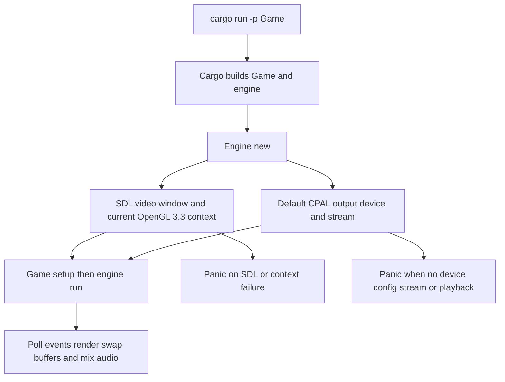
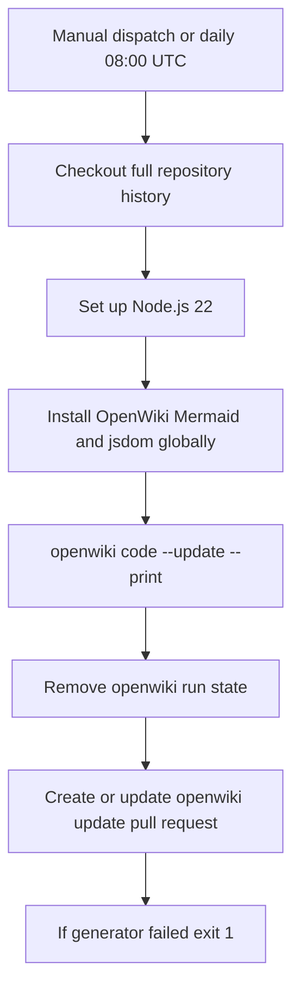

The repository is a virtual Cargo workspace containing the `engine` library and the `Game` binary. `Game` depends on the local `engine` crate, so building or running the application necessarily includes the engine. The normal operational distinction is important:

- **Build and test** compile the workspace and execute its Rust test targets.
- **Run the game** enters `Engine::new()` and therefore requires a usable native windowing, OpenGL, and default audio environment.
- **CI currently performs the first activity only.** Its successful `cargo test` result is not evidence that a graphical window, OpenGL renderer, audio callback, or interactive game loop ran on the runner.

For runtime ownership and the loop entered by the binary, see [Engine Runtime and Crate Boundary](/openwiki/architecture/engine-runtime.md). For the graphics and audio implementation boundaries, see [Asset Import and OpenGL Rendering](/openwiki/integrations/assets-and-rendering.md) and [Audio Commands, Mixing, and Spatial Sound](/openwiki/integrations/audio-and-spatial-sound.md).

## Workspace entry points

Run commands from the repository root. The root manifest has no package of its own; it declares the `engine` and `game` members with Cargo feature resolver version 2. The executable package is named `Game` and declares `src/main.rs` as its `Game` binary.

```bash
# Compile the workspace in the development profile.
cargo build --workspace

# Run the complete workspace test suite.
cargo test --workspace

# Fastest focused engine check.
cargo test -p engine

# Compile and launch the sample game from the workspace root.
cargo run -p Game
```

`cargo run -p Game` is an interactive smoke test, not a CI-safe test command. Its bootstrap loads models and WAV files using paths such as `resources/models/cube/Cube.gltf` and `resources/sounds/pop.wav`; running at the workspace root preserves those relative paths. The process then constructs `Engine` and calls `engine.run()`, which continues until SDL receives a quit event.

### What the existing tests cover

Use the focused engine command while changing CPU-side engine code. The checked-in suite includes unit tests for action history, time-resource behavior, colliders, movement and physics, dynamic-AABB-tree operations, GJK/EPA collision work, and asset geometry/image conversion. The two integration tests in `engine/tests/` install `dhat::Alloc` as each test binary's global allocator; `dhat` is an ordinary engine dependency, not a dev-dependency gated by the empty feature.

The dynamic-AABB-tree integration test is a real steady-state allocation regression: it warms up 64 leaves and a reinsertion, records heap totals, performs 100 update/query iterations, collects fresh totals, and asserts a zero-byte increase. The EPA test checks a positive initial penetration and repeats the operation 100 times, but its final subtraction reads two values from the same pre-loop `HeapStats` snapshot. Its zero-delta assertion therefore cannot detect allocations made by those repeated calls. Do not treat that EPA target as allocation proof until it takes a fresh post-loop snapshot; it remains useful as a repeated-call correctness check.

The Criterion target `engine/benches/my_benchmark.rs` benchmarks broad-phase tree updates for 1,024 spaced convex spheres and manifold generation for 512 radius-1 spheres in two overlapping grid densities: spacing `1.5` and `0.9`. Run it deliberately rather than treating it as part of `cargo test`:

```bash
cargo bench -p engine --bench my_benchmark
```

These targets construct ECS worlds and physics data directly. They do not exercise the `Engine::new()`/`Engine::run()` application path. Accordingly, a green test suite is useful for pure engine behavior but does not validate real presentation, device selection, or sound output. Test changes to SDL context setup, rendering, or CPAL callback/device behavior on a machine with the runtime prerequisites below.

## Cargo configuration: environment, profiles, and feature switches

### Build-script environment

`.cargo/config.toml` sets `CMAKE_POLICY_VERSION_MINIMUM = "3.5"` in Cargo's shared `[env]` configuration. Cargo-launched builds inherit that setting, including native build-script work. Treat it as workspace build configuration: retain or deliberately update it alongside CMake-using native dependency changes, rather than treating it as an application runtime setting.

### Profiles

The workspace root defines the shared Cargo profiles. The development configuration intentionally optimizes dependency packages at level 3 while its base dev profile uses level 0 optimization, debug information, and no LTO. This favors debuggability of local workspace code while avoiding fully unoptimized dependency builds.

| Selection | Configured behavior | Typical command |
| --- | --- | --- |
| `dev` | `opt-level = 0`, `debug = true`, `lto = false`; dependency packages matched by `[profile.dev.package."*"]` use `opt-level = 3`. | `cargo build --workspace` or `cargo run -p Game` |
| `release` | `opt-level = 3`, `lto = true`, `debug = false`. | `cargo build --release --workspace` or `cargo run --release -p Game` |
| `profiling` | Inherits `release`, restores debug information, disables LTO, and sets `split-debuginfo = "off"`. | `cargo build --profile profiling --workspace` or `cargo run --profile profiling -p Game` |

Both crates declare an empty `dhat-heap` feature. In the current sample application, enabling `Game`'s feature installs `dhat::Alloc` as the global allocator and starts a heap profiler for the run:

```bash
cargo run -p Game --features dhat-heap
```

Cargo features are package-scoped: `-p Game --features dhat-heap` enables the application feature, while `-p engine --features dhat-heap` selects the separate engine feature. The engine manifest declares the latter as an empty extension point. The heap-focused engine integration tests use the engine's regular `dhat` dependency and set their own global allocators, so neither target requires enabling `dhat-heap`.

The manifests use Rust edition 2024. They also contain target-conditional native and `wasm32` dependency sections, but the versioned automation has only an Ubuntu native build/test job; it does not provide a cross-compilation or browser execution matrix.

## Native build baseline versus runtime requirements

The Rust workflow is the repository's concrete Linux build baseline. Before compiling, its Ubuntu runner installs:

```bash
sudo apt-get update
sudo apt-get install -y \
  libwayland-dev \
  pkg-config \
  libsdl2-dev \
  libx11-dev
```

That list describes what the checked-in CI provisions as its Ubuntu native build baseline. Both manifests request `sdl2` with its `bundled` feature; the workflow nevertheless installs `libsdl2-dev` and the Wayland/X11 discovery packages. Do not infer from the workflow that this is the minimal package set for every host or that all of its packages are selected directly by the manifests. The engine additionally declares `glow` for OpenGL and `cpal` for audio. On Linux the resolved lockfile includes `alsa` and `alsa-sys`, and `alsa-sys` depends on `pkg-config`, so the installed discovery tool also participates in the resolved native audio dependency graph. None of this provisioning makes an interactive desktop available.

### Requirements to launch `Game`

A machine that merely compiles the project is insufficient for `cargo run -p Game`. During `Engine::new()`, the engine:

1. initializes SDL and its video subsystem;
2. requests a resizable SDL OpenGL window, a forward-compatible core OpenGL **3.3** context, and a 24-bit depth buffer; makes that context current; and obtains OpenGL procedures for `glow`;
3. creates the renderer; and
4. creates the default `AudioMixer`, which requires a default CPAL output device and default output configuration, builds an output stream, and starts playback.

In practical terms, run on a native graphical session with a compatible OpenGL driver/context and a usable default output device. The game uses SDL's event pump and presents with `gl_swap_window`; a headless shell or a host without a display server/desktop session does not meet the windowing requirement. A real output device is likewise required even if a particular test scene has no audible event, because mixer construction happens during engine construction.



*The interactive launch path requires successful SDL/OpenGL and CPAL initialization before the game loop can begin.*

### Failure posture and diagnosis

This initialization path is deliberately fail-fast rather than a fallback-to-headless or mute mode. SDL initialization, video setup, window creation, GL context creation/current-context setup, and event-pump creation use `unwrap`. Audio setup uses `expect` for the default output device and stream build/play calls and `unwrap` for the default device configuration. Thus a missing display, incompatible context, or unavailable default output device terminates startup rather than returning an application-level error.

Treat failures in two layers:

1. **At build/link time**, make the platform's native build requirements and discovery tools available. On Ubuntu, first compare the local environment with the exact CI package list above; `pkg-config` and `libsdl2-dev` are explicit workflow provisioning, even though the manifests select bundled SDL2.
2. **At launch time**, verify the actual user session: display/window system access, an OpenGL 3.3-core-capable driver, and a default audio output device. A build that passed in a noninteractive environment says nothing about this layer.

Do not paper over these requirements by claiming CI tests the game headlessly. No workflow step launches `cargo run`, invokes `Game`, or provisions a virtual display or virtual audio device. Adding a graphical smoke test would need to deliberately supply those services and define what rendering/audio result it verifies.

## Rust GitHub Actions workflow

`.github/workflows/rust.yml` defines a single `build` job on `ubuntu-latest`. It runs for pushes to `master` and pull requests targeting `master`, sets `CARGO_TERM_COLOR=always`, checks out the repository, installs the Linux packages above, then executes exactly:

```bash
cargo build --verbose
cargo test --verbose
```

Because those commands run from the virtual-workspace root, the workflow is the broad compile-and-test gate for the workspace. It contains no formatting, Clippy, benchmark, release-profile, feature-matrix, cross-target, package-artifact, or interactive runtime stage. Keep that observed scope in mind when deciding whether a local focused check is enough: changes to pure physics can start with `cargo test -p engine`, but changes to the game bootstrap or platform backend also need an interactive smoke test.

## Scheduled OpenWiki automation

The documentation workflow is independent of the Rust CI job. `.github/workflows/openwiki-update.yml` runs either manually through `workflow_dispatch` or daily at `08:00` UTC (`0 8 * * *`). It has repository `contents: write` and `pull-requests: write` permissions because its output mechanism is a pull request, not a direct push to `master`.



*The OpenWiki job preserves completed documentation changes in a pull request even when generation reports failure, then marks the workflow failed.*

The checkout uses `fetch-depth: 0`; the workflow comments explain that `openwiki code --update` needs the prior documented commit available to calculate a meaningful change summary. It sets up Node.js 22 and globally installs pinned versions of `openwiki`, `mermaid`, and `jsdom`, then runs:

```bash
openwiki code --update --print
```

The command receives its OpenAI provider/model configuration and API key through environment variables, plus an OpenWiki LangSmith connector key and optional LangSmith tracing credentials. These values are sourced from GitHub Secrets; they should be configured as workflow secrets rather than committed to source.

The generator step is intentionally `continue-on-error: true`. Unless the job was cancelled, later steps remove the transient `openwiki/.run.json` file and use `peter-evans/create-pull-request` to create or update branch `openwiki/update`. The action's `add-paths` restricts the proposed changes to `openwiki`, `AGENTS.md`, `CLAUDE.md`, and the workflow file; it uses the `docs: update OpenWiki` commit message and pull-request title. If generation failed, the pull-request body records that outcome and says the PR preserves pages completed before failure; a final step then exits with status 1 so the workflow is visibly failed. Review and merge such a partial PR when appropriate to establish the next update baseline.

## Change checklist

- Build/test changes: run the smallest relevant package command first, then `cargo test --workspace` for shared changes. Use the profiling profile or Criterion only when measuring a defined performance question.
- Allocation-sensitive changes: use `dynamic_aabb_tree_heap_test` for its implemented warm-up-to-post-loop heap assertion. Repair the EPA target to capture fresh post-loop `HeapStats` before using it as a steady-state allocation gate.
- Game/platform changes: validate `cargo run -p Game` from the workspace root on a graphical, audio-capable machine. Confirm startup, window creation, OpenGL output, event handling, and audio-device behavior; CI does not cover this.
- Dependency changes: if native linkage or CMake policy handling changes, update the Rust workflow provisioning, `.cargo/config.toml`, and manifests/lockfile together as applicable so the documented CI baseline remains reproducible.
- Documentation automation changes: preserve full-history checkout if incremental update semantics still depend on diffs, keep sensitive configuration in secrets, and retain the deliberate partial-progress/failed-status behavior unless changing that operational policy intentionally.
