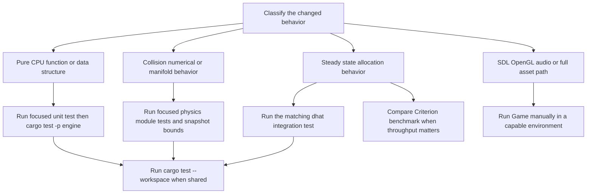

## Purpose and scope

This page is a **change-validation guide**, not a promise that the current suite exercises every runtime integration. Start with the smallest executable test that encodes the behavior being changed, then expand to the relevant package or workspace gate. In particular, collision tests establish numerical *contracts*—classification, orientation, bounded penetration, and contact count—not bit-for-bit results from every floating-point path. Heap tests establish a separate steady-state allocation expectation after their stated warm-up.

The workspace contains the `engine` library and the `Game` binary. GitHub Actions builds and tests the workspace on Ubuntu, but it does not launch the SDL/OpenGL/CPAL application. A passing automated suite is therefore evidence for compiled and CPU-testable behavior, not for a working window, renderer, audio device, asset presentation, or interactive event loop. See [Build, Platform Dependencies, and Automation](/openwiki/operations/build-and-ci.md) and [Engine Runtime and Crate Boundary](/openwiki/architecture/engine-runtime.md) for the operational/runtime boundary.

## Select the check by change surface



*The validation path branches by observable change: automated CPU checks cover engine contracts, whereas device-backed runtime integrations require an explicit manual smoke test.*

### Focused commands

Run commands at repository root:

```bash
# Broad local equivalent of the checked-in Rust test gate.
cargo test --workspace

# CPU-side engine unit tests plus its integration tests.
cargo test -p engine

# Narrow physics/data-structure diagnosis.
cargo test -p engine dynamic_aabb_tree
cargo test -p engine gjk
cargo test -p engine epa
cargo test -p engine collision_system

# Heap-regression integration targets; dhat is installed by the tests themselves.
cargo test -p engine --test dynamic_aabb_tree_heap_test
cargo test -p engine --test epa_heap_test

# Performance comparison, deliberately separate from cargo test.
cargo bench -p engine --bench my_benchmark

# Game settings tests, including serialized tests that change HOME and XDG_CONFIG_HOME.
cargo test -p Game settings
```

The name filters above are diagnostic conveniences; `cargo test -p engine` remains the safer package-level check when a change crosses physics modules. `cargo test --workspace` is appropriate after shared manifest, engine/game interface, or cross-crate changes. Criterion benchmarks are measurements, not pass/fail CI gates: run the named benchmark before and after a throughput-sensitive change under comparable machine/load conditions.

## Executable coverage that matters

### Time and deterministic test setup

`TimeResource` tests check the default 60 Hz frame and simulation durations, constructor-selected rates, fixed-dt setter/accessor agreement, explicit frame-delta accumulation, and the ECS system's elapsed-time update. For systems that consume fixed simulation time, inject a known `TimeResource` into a small `World` or call the pure operation with explicit transforms rather than relying on wall-clock timing. The normal scene configures its fixed rate separately, so test the rate that the system actually reads rather than assuming a default.

### Physics numerical regression contracts

The physics tests provide layered coverage:

| Change area | Existing executable assertions | What to preserve or add |
| --- | --- | --- |
| Convex support and GJK | Collider tests cover support under translation/rotation and zero directions. GJK tests cover intersections and separations for cubes, spheres, cuboids, rotations, non-uniform dimensions, coincident centers, thin shapes, and near-coplanar/touching cases. An intersection handed to EPA must contain a four-point tetrahedral simplex. | Add both hit and no-hit cases near the changed boundary; retain the exact-touching versus slight-overlap distinction and assert the tetrahedron requirement when EPA is downstream. |
| EPA penetration | EPA tests cover axis-aligned/rotated boxes, sphere-box combinations, deep overlap, non-uniform cuboids, and nearly coplanar sweeps. They assert positive penetration, A-to-B-compatible normal direction, and use tolerances for approximate depths rather than exact float identity. | Test the smallest meaningful penetration and the expected normal sign. Keep an approximate numeric assertion only where a known analytic depth is the API contract. |
| Convex/mesh contacts and manifolds | Collision-system tests verify sphere/cuboid contacts against triangles, unit-length/oriented normals, candidate clustering, and a four-contact reduction cap. A face-to-face cuboid test expects four distinct positive-penetration contacts. | Include collider ordering, world/local transform, and contact-cap behavior when editing contact reduction or manifold merge logic. |
| Broad phase | Dynamic-tree tests validate parent/child links, heights, union AABBs, leaf lifecycle, free-list reuse, rotations, query results, degenerate bounds, seeded random updates, and nondegenerate height limits. | Retain structural invariant checks as well as query results; a result-only test can miss corrupted bookkeeping that fails later. |

The numerical boundary is intentional. GJK treats exactly coplanar/touching cuboid faces as `NoIntersection`, while its nearby-overlap cases require a tetrahedron. EPA uses finite iteration and tolerance limits, then returns its best closest-face result if it reaches the iteration cap. Do not replace tolerance/bound checks with brittle full-float equality unless the computation is deliberately made deterministic to that precision.

### Scene-derived snapshots are bounded regression cases

`collision_system.rs` contains small reproductions based on a main-scene ground OBJ and recorded convex transforms. Each invokes the actual convex-versus-mesh contact path and requires a nonempty reduced result whose greatest penetration is no more than `0.50`; there are two recorded transform cases. A separate recorded manifold test protects against incorrectly collapsing four spatially distinct contacts that share normal and penetration.

These are **not** image snapshots or a complete scene smoke test. They are valuable when changing mesh contact candidate generation, reduction distance, transform handling, triangle proxies, or manifold continuity because they retain observed problematic geometry. When a legitimate algorithm change exceeds a bound, investigate the input/contact path first; update the recorded transform or bound only with an explanation of the new physical/numerical contract.

### Transform and scale edge cases

A `TransformComponent` produces `translation * rotation * scale`. The cuboid narrow-phase tests show that uniform and non-uniform scale participate in overlap/depth decisions, including rotated-and-scaled cases. Retain a case where scaling moves a pair from separated to overlapping and one with a rotated, non-uniform cuboid if changing SAT axes, transformed AABBs, support mapping, or matrix composition.

Sphere behavior needs a deliberately different test expectation today: the sphere broad-phase AABB scales its radius by the transform's largest axis, but specialized sphere-sphere narrow phase reads the stored radii and ignores transform scale. The existing tests assert that scale and rotation do not change that sphere-sphere overlap state. Do not silently make scale physical in only one phase: either preserve this discrepancy with its regression test or update AABB, narrow phase, and tests as one coherent behavior change. See [Physics, Collision Detection, and Events](/openwiki/concepts/physics-and-collision.md) for the pipeline and geometry contracts.

## Allocation checks: warm up before judging steady state

The `engine` crate declares `dhat` and both integration tests install `dhat::Alloc` as the test binary's global allocator, then build a testing profiler. They do **not** require enabling the empty `dhat-heap` Cargo feature. Keep them as isolated integration targets because a global allocator is process-wide.

### Dynamic AABB tree expectation

`dynamic_aabb_tree_heap_test.rs` inserts 64 leaves and performs an out-of-fat-AABB update during warm-up, verifies that warm-up allocated something, then repeats 100 update/query iterations. It asserts that `dhat::HeapStats::total_bytes` does not increase after the warm-up checkpoint. This specifically protects the allocated/reused tree storage and the update/query path; it is not a claim that initial population or arbitrary growth is allocation-free.

Run it after changing node allocation/recycling, tree capacity, leaf update/reinsertion, query traversal, or callback/result collection behavior:

```bash
cargo test -p engine --test dynamic_aabb_tree_heap_test
```

### GJK/EPA expectation

`epa_heap_test.rs` first runs GJK to obtain an intersection simplex and EPA for two overlapping cubes, requires positive penetration and nonzero initial allocation, then performs 100 more calls. Its intended contract is zero additional allocated bytes after the first operation. EPA reserves working-vector capacity and GJK starts its simplex with capacity four, so a performance change should be evaluated against repeated representative calls, not against one-time setup.

```bash
cargo test -p engine --test epa_heap_test
```

If either test fails, distinguish a real steady-state regression from an accidental test-shape change: check that the warm-up reached the same code path/capacity demand as the loop, that the profiler remains alive through both snapshots, and that logging/assertion formatting did not enter the measured region. If the workload must legitimately grow, revise the workload and expectation explicitly; do not weaken a zero-delta assertion into an unconstrained observation.

## Benchmarks versus allocation tests

The Criterion bench target constructs ECS worlds directly. It measures broad-phase tree updates for 1,024 spaced convex spheres and manifold generation for 512 spheres in both spaced and touching grids. It jiggles transforms each iteration and chains the relevant collision systems. This is the right comparison tool for changes that may preserve allocation behavior but alter tree traversal, candidate volume, Rayon work, or contact generation time.

It does not exercise `Engine::new()` or `Engine::run()`, real rendering, SDL events, OpenGL uploads, audio devices, or game bootstrap. Interpret a benchmark improvement narrowly: it is evidence for those constructed CPU workloads, not a frame-time guarantee for the application.

## Settings persistence tests and global process state

`game/src/settings.rs` has both pure serialization/deserialization checks and filesystem-backed tests. The latter make a temporary configuration directory, change `HOME` and `XDG_CONFIG_HOME`, then restore them; they use `#[serial]` because environment variables are process-global. They cover user/default path selection, valid/corrupted/missing settings fallback, file creation and serialization, and the Unix permission-error case. Keep new environment-mutating settings tests serial, use a `TempDir`, capture/restore every changed variable on all normal paths, and avoid relying on a developer's real config directory.

One attempted `ConfigDirNotFound` test is marked `#[ignore]`, because simulating no configuration directory is unreliable under `dirs-next` fallbacks. It will not run under the ordinary commands above. Run it explicitly only while working on that edge case and treat its platform behavior as an integration concern:

```bash
cargo test -p Game config_dir_not_found -- --ignored --test-threads=1
```

The Unix permission test is platform-specific and should be assessed on an appropriate non-privileged Unix environment; elevated test execution can invalidate a write-denial expectation.

## CI gate and untested runtime integrations

The Rust workflow runs on `ubuntu-latest` for pushes and pull requests targeting `master`. It checks out the source, installs `libwayland-dev`, `pkg-config`, `libsdl2-dev`, and `libx11-dev`, then runs `cargo build --verbose` and `cargo test --verbose`. It does not run formatting/lint, benches, allocation profiling as a named CI stage, feature/target matrices, a release profile, or the interactive binary.

Consequently, add deliberate manual validation when changing any of the following:

- **Engine lifecycle or scheduling:** launch `cargo run -p Game` on a machine with a display, compatible OpenGL context, and default audio output; exercise startup, quit, a zero-step frame, multi-step frame, and any changed scene behavior.
- **Rendering or GPU assets:** verify real imported assets, culling, shader compilation/reflection, texture upload, and draw output. Existing `model_loader` tests only validate CPU conversion of accepted glTF image formats and rejection of an unsupported format; they do not execute full import or OpenGL rendering.
- **Audio:** verify device selection, stream creation, callback output, and the changed audible behavior on a usable output device.
- **Full model-load paths:** use representative `.gltf`/`.glb`/`.obj` assets for success and invalid/missing attributes/textures for failure posture. The loader's supported-format path touches files, shared resources, and GPU-facing resources that its image-conversion unit tests do not cover.

For any runtime integration that becomes important enough to gate, first extract pure data/control logic into testable units or add a controlled platform harness, then define what observable result is expected. Do not describe a `cargo test` success as proof of an integration that it never invokes.

## Change checklist

1. **Map the behavior to an existing contract.** Choose a focused low-level test for support/GJK/EPA, broad phase, manifold reduction, timing, asset conversion, or settings persistence. Add a regression before changing ambiguous behavior.
2. **Test the two sides of a numerical threshold.** For collision changes, include contact and separation, exact touch and just-inside cases where relevant, normal orientation, and toleranced penetration/depth bounds. Preserve the four-point simplex and contact-cap contracts at their respective boundaries.
3. **Use recorded collision snapshots purposefully.** Run the main-scene penetration bounds after changing convex-mesh contacts. They detect a class of regression but cannot replace a broader scene/runtime test.
4. **Check transform semantics.** Cover translation, rotation, and uniform/non-uniform scale. Explicitly decide whether a change affects broad phase, narrow phase, or both—especially for spheres.
5. **Measure only steady state after equivalent warm-up.** Run the matching `dhat` test if the modified path repeats each fixed step; use Criterion to compare throughput, not as a substitute for the allocation assertion.
6. **Contain global state.** Keep settings tests that mutate environment variables serial and isolated. Do not enable ignored tests accidentally without acknowledging their assumptions.
7. **Finish at the proper boundary.** Run `cargo test -p engine` or `cargo test --workspace` as warranted, then perform the required graphical/audio/manual smoke test for paths CI does not execute.
